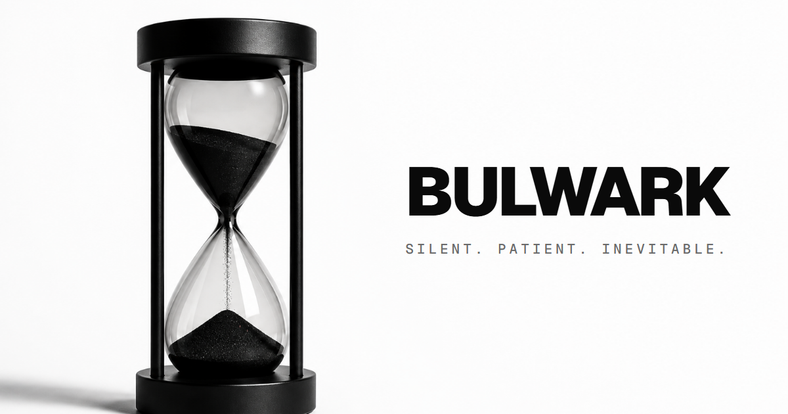
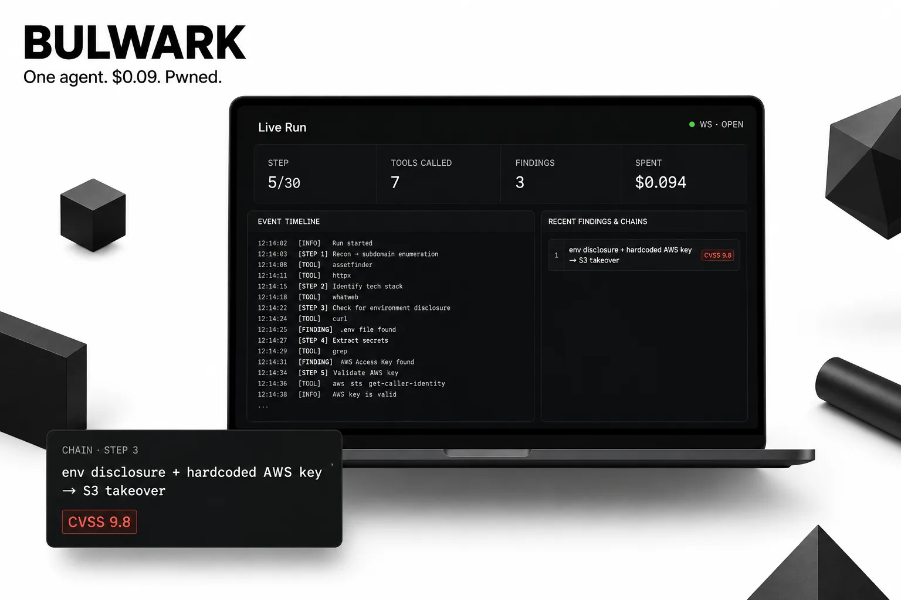
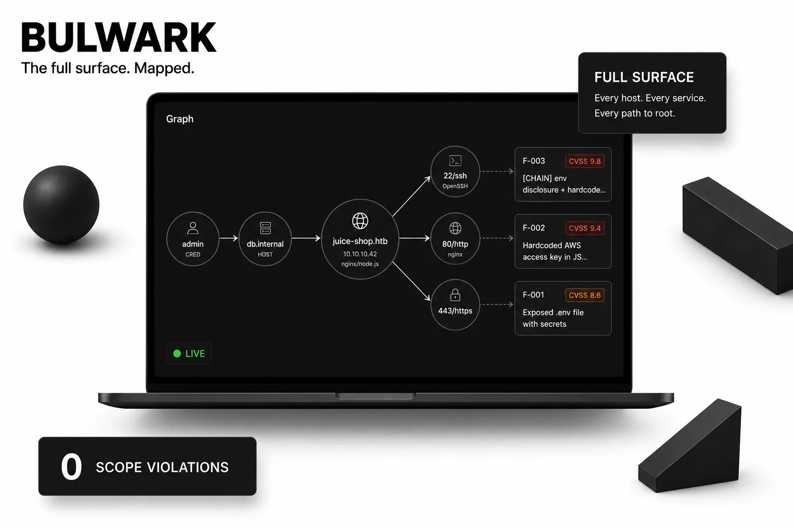
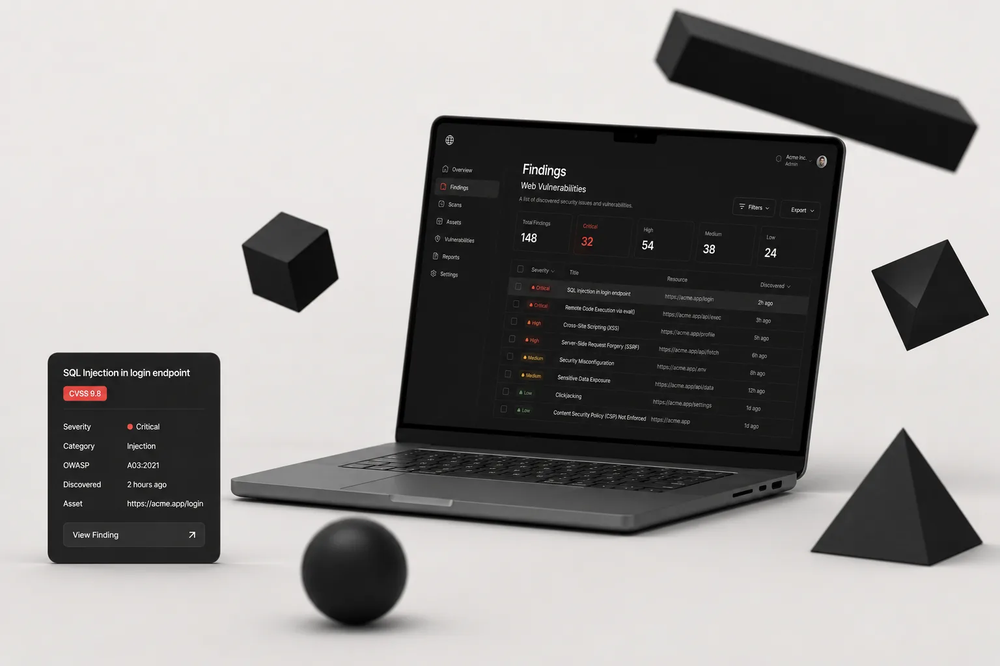
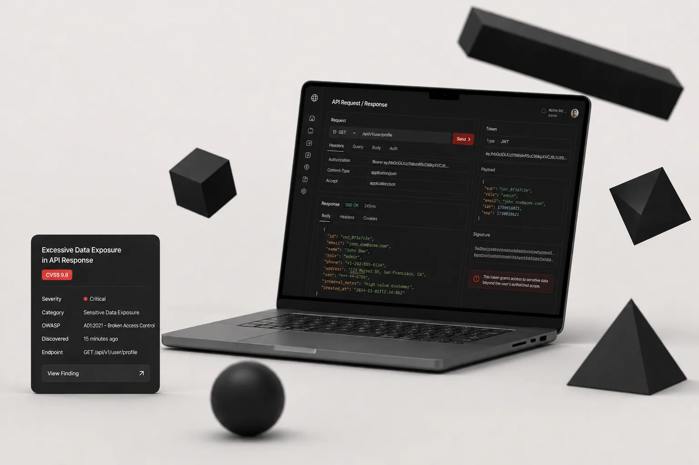
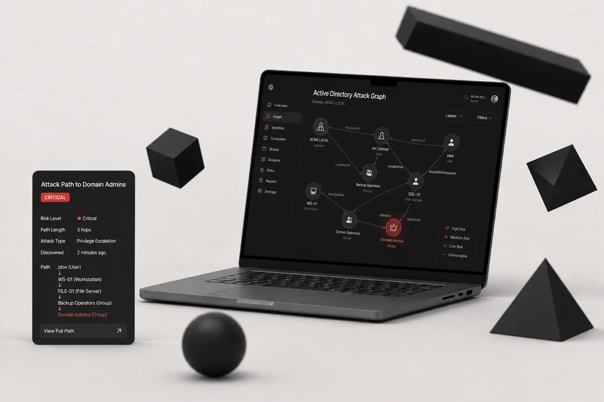

<div align="center">

<br>

<sub>Autonomous external pentest agent · one agent, not seventeen · hardened sandbox · full audit trail</sub>

<br><br>

[](LICENSE)
[]()
[]()
[]()

<br>

[](https://getwark.com)

<br><br>



</div>

---

<br>

<table>
<tr>
<td width="25%" align="center" valign="top">
<br>

**One agent**  
not seventeen

A single hand-written ReAct loop. No framework, no orchestrator. You can read it and reason about it.

<br>
</td>
<td width="25%" align="center" valign="top">
<br>

**Stealth-first**  
not loud

Quiet and patient by default. The client finds out if their detection actually works.

<br>
</td>
<td width="25%" align="center" valign="top">
<br>

**Safety is**  
the product

Six independent guardrails built for a rogue LLM. The operator is liable — the constraints are the core.

<br>
</td>
<td width="25%" align="center" valign="top">
<br>

**Proof**  
not theatrics

Honest dead-ends documented. Findings confirmed before marked exploitable. Audit log for everything.

<br>
</td>
</tr>
</table>

<br>

BULWARK is a local desktop app. Point it at an authorized scope — a domain or IP range — and walk away. It spins up a hardened Kali sandbox, verifies your exit IP, and runs a single autonomous agent loop across the full external surface: recon → enumeration → vulnerability discovery → exploit confirmation → structured report.

No babysitting. No out-of-scope packets. No leaked IPs. No runaway LLM cost.

---

<br>

## Why it's different

The AI pentest agent space is full of LangGraph zoos, Docker socket mounts, and self-published benchmarks. BULWARK is the opposite of all of it.

<br>

<div align="center">

| | The field | BULWARK |
|:---:|:---|:---|
| | 17 specialized agents in a framework | **One** ReAct loop — hand-written, no framework |
| | Docker socket mounted inside the container | Host-only Docker — nothing to escape with |
| | Neo4j / vector DB / RAG for memory | **Markdown vault** — open any file in a text editor |
| | LLM call per attack variation | Deterministic in-code cascades — no extra token cost |
| | "Fast and loud, you're authorized" | **Stealth-first** by default, egress-verified |
| | Self-published, flattering benchmarks | Audit-logged runs you could reproduce yourself |

</div>

<br>

> One agent, not seventeen. One tool, not an orchestrator. Markdown, not graph databases. Stealth, not theater.

---

<br>

## Proof

Real runs. Audit-logged. Reproducible.

<br>

> [!IMPORTANT]
> **HackTheBox — easy box, fully autonomous**  
> Both `user.txt` + `root.txt` retrieved with zero operator input.  
> **88 steps · $0.93 LLM cost · fresh box · full audit log.**

<br>

> [!IMPORTANT]
> **HackTheBox — medium box, autonomous exploit chain**  
> JWT `alg=none` → SSH certificate-authority abuse → root.  
> No hand-holding. Full chain documented.

<br>

> [!NOTE]
> In one run, the agent marked a command-injection finding as `not_exploitable` instead of fake-confirming it, then found a real path on its own. **It doesn't lie to look good.** That's the point.

<br>

<div align="center">

</div>

<br>

- 1,700+ automated tests passing — strict type-checking and linting clean
- Independently, adversarially code-audited — safety-critical guards verified
- Hand-written loop you can read, not an opaque orchestration

---

<br>

## Safety — six layers

BULWARK treats the LLM as part of the threat model. It assumes the AI might jailbreak, hallucinate, or go rogue — and is engineered so that even then, it cannot cause harm.

<br>

<table>
<tr>
<td width="4%" align="center"><b>1</b></td>
<td width="22%"><b>Scope guard</b></td>
<td>Every command parsed and checked against authorized targets before execution. Cannot be tricked into touching an out-of-scope address.</td>
</tr>
<tr>
<td align="center"><b>2</b></td>
<td><b>Egress filter</b></td>
<td>Network drops everything by default. Only resolved in-scope IPs and the LLM provider are allowed through.</td>
</tr>
<tr>
<td align="center"><b>3</b></td>
<td><b>Hardened sandbox</b></td>
<td>Read-only filesystem. Non-root. No Docker socket exposed. Thrown away after the run. Nothing to escape with.</td>
</tr>
<tr>
<td align="center"><b>4</b></td>
<td><b>Hash-chained audit log</b></td>
<td>Every action — tool call, exploit step, guard decision — recorded in a tamper-evident, optionally encrypted log. Fully reproducible.</td>
</tr>
<tr>
<td align="center"><b>5</b></td>
<td><b>Budget guard</b></td>
<td>Hard cost cap checked before every LLM call. The agent cannot exceed the budget you set.</td>
</tr>
<tr>
<td align="center"><b>6</b></td>
<td><b>IP guard</b></td>
<td>Verifies your anonymizing exit IP on host and inside the container. Freezes the engagement if it drifts. Your real IP cannot leak.</td>
</tr>
</table>

<br>

> The guardrails are not a checkbox. They are the core engineering. For operators contractually responsible for what the tool does — that's the reason to use it.

---

<br>

## How it works

```
┌─────────────────────────────────────────────────────┐
│                      OPERATOR                       │
│         scope · LLM key · budget · auth PDF         │
└────────────────────────┬────────────────────────────┘
                         │  exit IP verified
         ┌───────────────▼────────────────┐
         │          AGENT LOOP            │
         │                                │
         │  recon → enumerate → vulns     │
         │       → exploit cascades       │
         │                                │
         │  scope guard  ·  budget guard  │
         └───────────────┬────────────────┘
                         │
         ┌───────────────▼────────────────┐
         │        MARKDOWN VAULT          │
         │  findings · steps · evidence   │
         │  readable in any text editor   │
         └───────────────┬────────────────┘
                         │
         ┌───────────────▼────────────────┐
         │    HARDENED KALI SANDBOX       │
         │  read-only · non-root          │
         │  no docker socket exposed      │
         │  network: in-scope IPs only    │
         └────────────────────────────────┘
```

<br>

- ~40 LLM-facing tools — 27 static + ~15 deterministic exploit cascades (no extra token cost)
- 6+ OWASP playbooks · CWE library · CVE catalog
- Supports: **Anthropic Claude** (primary) · OpenAI-compatible (DeepSeek, Kimi, GLM)
- Ships as Tauri desktop app + single-binary CLI — `bulwark`

---

<br>

## Plugins

The core agent loop is open source under BSL. The offensive capability — playbooks, exploit cascades, CVE catalog — ships as plugins via [getwark.com](https://getwark.com), grouped by engagement surface:

<br>

<table>
<tr>
<td width="33%" align="center" valign="top">

<br><br><b>FRONTIER</b><br><sub>Web &amp; application layer</sub>
<br><br><sub>OWASP Top 10 · SSRF → IMDS · SSTI → RCE · XXE · SPA via headless browser</sub>
</td>
<td width="33%" align="center" valign="top">

<br><br><b>CONDUIT</b><br><sub>API &amp; service layer</sub>
<br><br><sub>REST · GraphQL · JWT alg=none · OAuth/OIDC · SAML · param mining</sub>
</td>
<td width="33%" align="center" valign="top">

<br><br><b>DOMINION</b><br><sub>Active Directory &amp; internal</sub>
<br><br><sub>Anonymous enum · ESC8 relay · Kerberoast · ACL abuse → Domain Admin</sub>
</td>
</tr>
</table>

<br>

Available as one-time packs for solo operators, or monthly subscriptions with updated attack content for teams and consultancies.

<div align="center">
<br>

[](https://getwark.com)

<br>
</div>

---

<br>

## License

Released under [Business Source License 1.1](LICENSE) — free to use, inspect, and build on. Commercial redistribution requires a separate agreement. Offensive plugins distributed under commercial license via [getwark.com](https://getwark.com).

<br>

<div align="center">
<sub>For authorized testing only. The authorization PDF requirement is a feature, not fine print.</sub>
</div>
